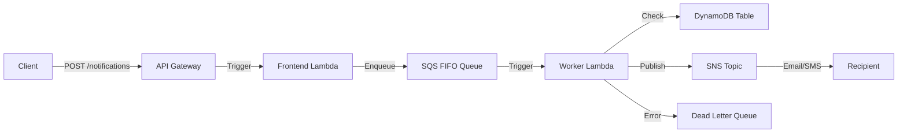

# Resilient Notification & Email Delivery Service

**Fault-tolerant, observable, production-grade notification system** with at-least-once delivery, idempotency, exponential backoff, DLQ recovery and full AWS observability.

## Features
- **At-least-once delivery** with idempotency guarantees
- **Exponential backoff + jitter** for resilient retries
- **Dead-letter queue (DLQ)** with one-click reprocessing
- **Full tracing** with AWS X-Ray
- **Real-time dashboard** (React)
- **100% IaC** with Terraform
- **Zero-downtime deployments**

## Tech Stack
- **Backend:** Python, FastAPI, AWS Lambda
- **Messaging:** SQS (FIFO), SNS
- **Database:** DynamoDB (On-Demand)
- **Observability:** CloudWatch, X-Ray
- **Infrastructure:** Terraform, Docker
- **Frontend:** React, TypeScript

## Getting Started

### Prerequisites
- AWS CLI configured
- Terraform >= 1.0
- Python 3.9+
- Node.js 16+

### Deploy Infrastructure
```bash
cd terraform
terraform init
terraform apply
```

### Run Backend
```bash
cd backend
pip install -r requirements.txt
uvicorn app.main:app --reload
```

# In-depth Architecture

The Resilient Notification Service is designed to be highly available, fault-tolerant and scalable. It leverages AWS managed services to ensure durability and operational excellence.

## High-Level Overview

The system follows an event-driven architecture where notification requests are ingested via an API, buffered in a queue and processed asynchronously by worker functions.



## Components

### 1. API Layer (FastAPI)
- **Role**: Entry point for notification requests.
- **Implementation**: FastAPI application running on AWS Lambda behind API Gateway.
- **Responsibilities**: 
  - Request validation (Pydantic models).
  - Authentication (planned).
  - Enqueuing messages to SQS.
  - Providing status endpoints.

### 2. Message Queue (Amazon SQS FIFO)
- **Role**: Buffer and ordering mechanism.
- **Configuration**: FIFO (First-In-First-Out) to ensure processing order.
- **Features**:
  - Content-based deduplication to prevent duplicate messages at the queue level.
  - Visibility timeout to handle processing failures.

### 3. Worker (AWS Lambda)
- **Role**: Message processor.
- **Responsibilities**:
  - Idempotency check against DynamoDB.
  - Message processing (sending simulated emails/SMS).
  - Updating status in DynamoDB.
  - Publishing events to SNS for fan-out.
  - Error handling and retry logic.

### 4. Storage (Amazon DynamoDB)
- **Role**: State store and idempotency registry.
- **Schema**:
  - Partition Key: `message_id`
  - Attributes: `status`, `recipient`, `retry_count`, `timestamp`
- **Usage**:
  - Stores the state of each notification.
  - Used to check if a message has already been processed (idempotency).

### 5. Dead Letter Queue (DLQ)
- **Role**: Failure handling.
- **Configuration**: Captures messages that fail processing after 5 attempts.
- **Recovery**: Can be redriven to the main queue for reprocessing after bug fixes.

## Resilience Patterns

- **Idempotency**: Prevents processing the same message multiple times, even if SQS delivers it twice (at-least-once delivery).
- **Exponential Backoff**: SQS retry policy handles transient failures with increasing delays.
- **Circuit Breaker**: (Implicit via concurrency limits) Prevents downstream system overload.
- **Dead Letter Queue**: Isolates poison pill messages to prevent queue blockage.

## Observability

- **AWS X-Ray**: Distributed tracing to visualize the request path and identify bottlenecks.
- **CloudWatch Logs**: Structured logging for debugging.
- **CloudWatch Metrics**: Custom metrics for "NotificationsSent", "NotificationsFailed", etc.


### Run Frontend
```bash
cd frontend
npm install
npm start
```
